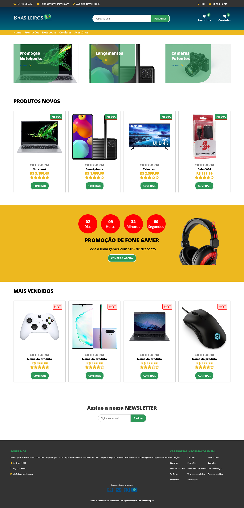
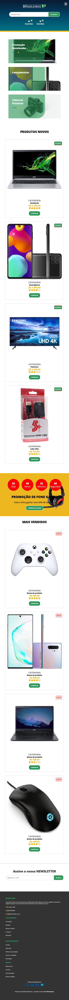
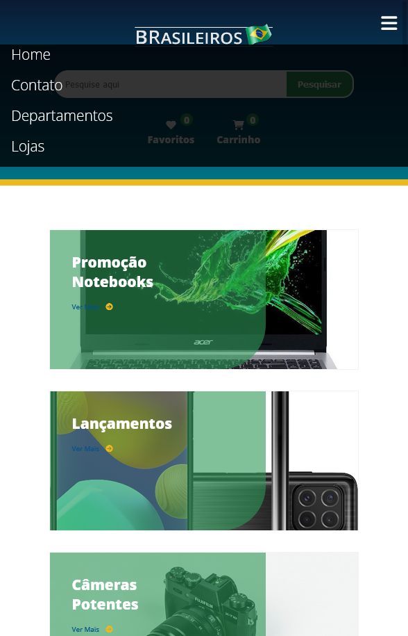

## Site fictício de um ''*e-commerce* ''  - Lojas dos Brasileiros

> Status do Projeto: concluído :heavy_check_mark:

- [x]  expirado nas cores do Brasil

- [x] totalmente responsivo
- [x] contém menu e menu mobile
- [x] seções de cabeçalho, banner, promoções, newsletter e produtos
- [x] um rodapé, com links e copyright 

### Criação  ###
#### O que foi usado na criação desse projeto !? ####
- projeto estruturado com a linguagem de marcação HTML5;
- estilizado com a linguagem  de marcação CSS3
- usando um facilitador o Sass, que adiciona mais recursos ao CSS
- menu responsivo feito na linguagem de programa JavaScript;
- imagens retirada do site:[google imagens, classificadas como domínio público]: https://www.google.com.br/imghp?hl=pt-BR&ogbl/ e ícones Font Awesome
- projeto estruturado em pastas conforme seu significado.
- CSS minificado via SASS gerando economia de espaço de memória com um arquivo menor

#### Pré-requisitos:
para visualizar o projeto é só abaixar todos os arquivos em uma pasta e abrir o arquivo **index.html** com seu navegador de preferência.

#### Resultado: ✨ 

**Desktop:**

**Mobile:**

**Menu-Mobile:**

